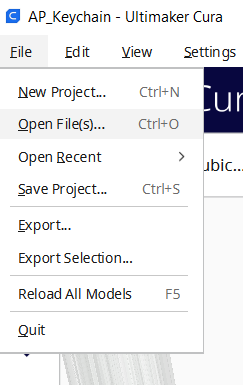

# Codettesbootcamp2022

## 10 Interface & Application Programming

**Objectives**

*Wk 1*

[x] Setup Dev Environment for ESP32 S2

[x] Setup NodeJS Dev Environment on your PC

[] Explain the HackOmation quadrant in relation to your final project.

[] Build UI mockups for your Final Project and HTML Layout

*Wk 2*

[] Build HTML5 Chat app
* Draw mockup / layout
* frame and add id’s to 
’s
* Style the page and 
* wire up the JS code and understand
  
*Wk 3*
  
[] Build Chat app back-end NodeJS
* Build NodeJS server side to: 
* host your ChatApp (Express static HTML)
* Build / test API endpoints (for: users & messages)
  
*Wk 4*
  
[] Setup MongoDB datastore & connect via NodeJS
* Setup MongoDB datastore + mongoose ODM (Object-Document-Manager)
* Store and recall message data using an API (ex. request top 100 msg)
* Wire up MongoDB to API endpoints
* Update app-flow to use back-end for Users and “old” messages
  
Wk 5
  
[] Create data-bound widgets to display sensor data
 * On ESP32 add MQTT client + ArduinoJSON
 * Send Sensor data to MQTT server (as a JSON object)
 * Create a DataCard, a Gauge and a time Chart widget on Dashboard (use chat app)
 * Strategy on DataBinding and Widget updating (Last updated)
 * User Login/Pw (state persistence)

[] Add Screenshots and description of the process of creation. 
  
[] Describe the design & programming steps
  
[] Screenshots or video of your Prototype/app working
  
[] Describe any errors or problems with the process and how you fixed them. 
  
[] Include all the files you created for download. 

  
  
### 10.1 Setup Dev environment ESP32 S2
#### 10.1.1 What is ESP32?

ESP32, like Arduino, is a development board. That means it has all the features you need to create your projects. ESP32 is a low-powered, low-cost microcontroller (MCU) board, with both Wi-Fi and Bluetooth built in, and is based on a dual-core processor mechanism.

#### 10.1.2 Install ESP32 board in Arduino IDE

There’s an add-on for the Arduino IDE that allows you to program the ESP32 using the Arduino IDE and its programming language.

I used the following instructions to install the ESP32 board in Arduino IDE:

1. In your Arduino IDE, go to File> Preferences and enter the following into the “Additional Board Manager URLs” field:
   https://raw.githubusercontent.com/espressif/arduino-esp32/gh-pages/package_esp32_dev_index.json
   
  
  
  
2. Open the Boards Manager. Go to Tools > Board > Boards Manager…
   
  
  
3. Search for ESP32 and press install button for the “ESP32 by Espressif Systems“:
  
  
  
4. Checking if ESP32 is available 
  

  
  

  
### 10.3 Business Model Canvas, Pitch & Poster
Objectives

- Setup your BMC for final project
- Setup Pitch Deck
- Create project poster
- Add Screenshots and description of the process of creation. 
- Describe the design & programming steps
- Screenshots or video of your Prototype/app working
- Describe any errors or problems with the process and how you fixed them. 
- Include all the files you created for download. 

#### 10.3.1 Setup project BMC
#####  What is a Business Model Canvas?
A business model canvas is a visual representation of a business model, highlighting all key strategic factors. In other words, it is a general, holistic and complete overview of the company’s workings, customers, revenue streams and more.
Canvas were initially proposed in 2005 by Alexander Osterwalder

#####  What’s the purpose of the Business Model Canvas?

Other than providing a general overview of the business model, these canvases enable companies to visualize and analyze their strategy. This includes updating the model as the company evolves, such as changes in the market, new streams or expansions. 

It is a template that defines the business - specifically, how each section interacts with the others. For example, understanding the value proposition, the target customer and the channels through which they are engaged all need to be analyzed together, not just in individual vacuums.

#####  Element of the Business Model Canvas
- Value Proposition
- Customer Relationship
- Customer Segments
- Channels
- Key Partners
- Key Activities
- Key Resources
- Cost Structure
- Revenue Stream

#####  Template Business Model Canvas
 

#####  Final Project BMC (Concept)
  
 
  
8 augustus 2022

#### FINAL BMC
  
 
  
24 januari 2023
  
#### 10.3.2 Setup project PitchDeck
##### What is a PitchDeck
A pitch deck, also known as a slide deck or start-up deck, is a presentation that provides a brief but informative overview of your business. It should cover the key points of your business plan, the products and services you provide, high-level financial projections, and funding needs.
  
Your pitch deck should work well on its own as a visual document, but it will primarily be used as a tool to tell the story of your business.
  
##### Things to include in your pitchdeck
  - Introduction
  - Problem
  - Solution
  - Product Features
  - Timing
  - Business Model Canvas (Value proposition)
  - Cost Price
  - Next Steps
  - Demo Project
  - Team

  Here is the link to my Project Pitchdeck: https://docs.google.com/presentation/d/1Zl2cTAf2jirbQVbZogcGsasVaAwgvvFysw9H8CzQDHk/edit?usp=sharing

#### 10.3.3 Project poster
##### What is a Project Poster?
  The project poster template helps you solve complex problems or tackle projects with unknowns.It is usually a mixture of a brief text mixed with tables, graphs,     pictures, and other presentation formats
  
- Project title and sub-title on top
- Explains your project intro/problem
- Shows your solution (pictures /schema / design)
- Shows impact /charts / graphs
- Plenty visuals of your project
- Cases + pictures
- It should attract visitors to visit your booth
- Team & future planning

##### My Project Poster:
  
   

  
  
  
### 10.4 Computer Aided Design (CAD)
Objectives
- Freecad
- Inkscape
- OpenSCad

#### 10.4.1 FreeCad
##### What is FreeCad?
FreeCAD is a general-purpose parametric 3D computer-aided design (CAD) modeler and a building information modeling (BIM) software application with finite element method (FEM) support.[3] It is intended for mechanical engineering product design but also expands to a wider range of uses around engineering, such as architecture or electrical engineering. 
  
##### Install Freecad 0.20.0
  
   

##### Select the units
Open freecad and 

#### 10.4.2 Inkscape
##### What is inkscape?
Inkscape is a free and open-source vector graphics editor used to create vector images, primarily in Scalable Vector Graphics (SVG) format. Other formats can be imported and exported.

Download link FreeCad: https://wiki.freecadweb.org/Download
  
Download link Inkscape: https://inkscape.org/release/1.1/windows/64-bit/

### 10.7 3D Printing
#### 10.7.1 What is 3D printing

Turns digital 3D models into solid objects by building  them up in layers. The 3D printing process turns a whole object into thousands of tiny little slices, then makes  it from the bottom up, slice by slice. Those tiny layers stick together to form a solid object.

#### 10.7.2 3D Printers & Filaments
  There arre two type of printers:
  1. ** Anycubic Predator (DeltaBot) ** :is a consumer 3D printer that uses DeltaBot technology (three robotic arms attached to a base). The Deltabot uses a print head     attached to 3 sets of robotic arms to deposit the material.
  2. ** Anycubic 4 Max Pro **: Enclosed Printing space with larger build volume enhance the printing quality, out of box, no need assemble, optional auto power off feature is safer for children. Patented printing platform with excellent adhesion whilst printing and pop off once it cools down. The sensor triggers the machine to pause prints and set off an alarm when filament run out.

  We will be 3D printing with the Anycubic Predator (Deltabot)
  
  There are two filaments:
  1. PLA (Polylactic acid)
  2. ABS (Acrylonitrile Butadiene styrene)
  
  PLA and ABS are both thermoplastics. PLA is stronger and stiffer than ABS, but poor heat-resistance properties means PLA is mostly a hobbyist material. ABS is weaker less rigid, but also tougher and lighter, making it a better plastic for prototyping applications.

  We will be working with the PLA Filament.
  And these are the PLA parameters we have to keep in mind while creating something in Cura
  
  
#### 10.7.3 Installing Cura
  Cura is an open source slicing application for 3D printers.
  For the bootcamp we will be using Cura for 3D printing.
  
  I used this link to install Cura version 5.0.0: https://github.com/Ultimaker/Cura/releases/tag/5.0.0
  
  
  After installing Cura from the .exe file i choosed the "sing up for free" option.
  
  Cura Installed:
  
  
#### 10.7.4 Cura settingss

1.The first thing we need to do after opening Cura after installing is selecting the printer we will be working with. So as I said we will be using the   Anycubic(Deltabot) printer so i have to to select the anycubic printer. 
That can be done by following this:
  ** SETTINGS → PRINTER → Manage Printer **
  
  
  After clicking manage printers we have to click on "Add New" and search for the anycubic predator printer in the "Add a non-networked" bar and than click on "Add".
  
  
2. Machine Settings

Now we have to check if we have the correct dimensions for the X,Y an Z directions . If not than you should probably have a wrong version of cura or another printer  installed.
We should have the following dimensions:
  X = 370
  Y = 370
  Z = 455
It is very important to check these dimensions cause while 3D printing the nozzle moves from top to bottom and if the dimensions are incorrect there are chances that the nozzle can break if it goes down too hard. And if the nozzles is broken the whole machine is ruined.
  
That can be done by following this:

** SETTINGS → PRINTER → Manage Printer → Machine settings **

  
3. Default Settings

Now we have to check all the PLA Parameters in the print settings. In the image below there are already some settings done but to check all of them we have to press on the "custom" button.
  

After pressing on custom there appears a list of parameters. 
We will begin with the first one.
  
Based on what profile you have selected if will give you the default parameters.
Right now we have selected "normal"

  
Quality:
- Layer height:  0.2 mm
  

  
Walls:
- Wall thickness: 0.8 - 1.2 mm
  

  
Infill:
- Infill density: 20%
- Infill pattern: you can select any pattern 
  

  
Material:
- Printing temperature: 200
- Build plate temperature: 60
  

  
Speed:
- Print speed: 60m/s
  

  
Travel:
- We have to enable retraction here 

  
Cooling:
- We have to enable print cooling here
  

  
Support:
- Support type: Everywhere
  

  
Build plate adhesion:
- Build plate adhesion type: Brim
 

  
  
These are all the parameters we have to check before printing.
But once you have the profile selected there is no need to go and check each of the parameters.
The parameters that are very important to check are:
  1. Support
  2. Cooling fan on
  
  
#### 10.7.5 3D Printing Preparations
First we have to design something so that we can 3D print it.
So I used tinkercad for the 3D designing and I designed a cute butterfly keychain.

  
To be able to use this design in Cura we have to export the design as a .STL file and save it anywhere.
I named it Keychain.stl saved the file in a new folder called 3D printing

  
Now to 3D print my design i have to open the .STL file in Cura.

** FILES → Open File(s) ** 

  
By clicking on "Open file(s)" a tab will appear where you can selct and open your .STL File.

  
After opening your .STL file your design should appear on the build plate

And after pressing the "Slice" button at the bottom in the right corner your design will be cutted in slices and it will tell you how long it will take to print your design(Time) and how much filament it will use to print it(gram and meters).
 
  
The next step is to make some adjustment before printing.
- Scale (Important to get the exact dimensions)
- Rotate (can rotate in any direction)
- Lay Flat (Make sure your print is flat. It makes a big difference when printing)
  
  
Now the object is finished for printing and we must press the "Save to disk" button which will save the object as a gcode file.

G-code stands for “geometric code,” and it tells the machine how to move. 
It relates to the geographical coordinates of the machine arm so that it knows how and where to move.

  

If i open the g.code file in brackets it looks like the image below.
It is a very long code

   

